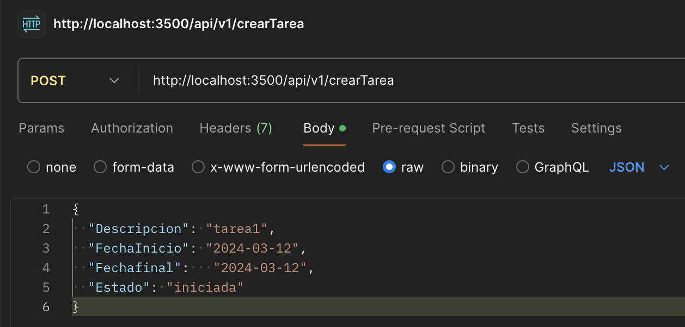
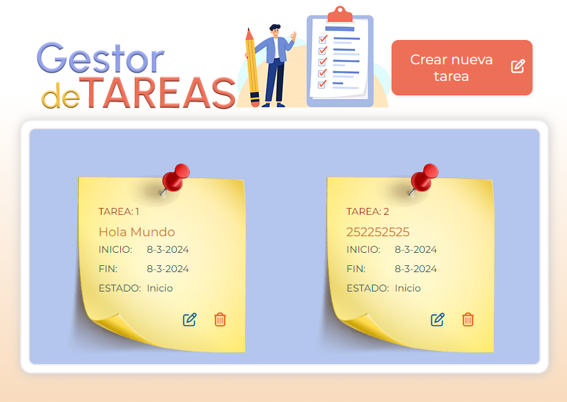
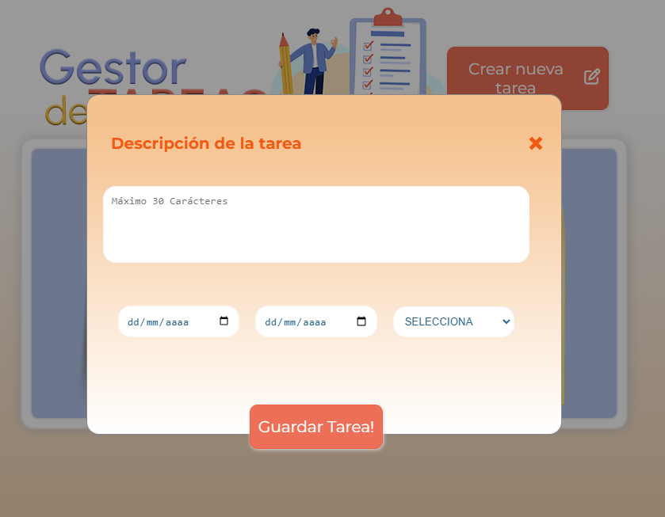

# Enunciado: proyecto api tareas
Proyecto que desarrolla una APIREST mediante NodeJS y MySQL. La api gestiona un CRUD de tareas

## 0.- Estructura e innicialización
 Aplicación de Gestor de Tareas utilizando MySQL, Node.js-Express, JavaScript, HTML5 y CSS3. 
 Aquí tienes una estructura para la documentación del CRUD:

Dentro del **package.json** veras las dependencias de nuestra aplicación(Mysql, espress, cors), una vez instaladas. E iniciado el servidor mysql puedes ejequtar nuestra api.js y crear la bbddd mediante el archivo BD/proyecto_tarea_PIJ.sql

## 1.- Introducción al CRUD:
### 1.1 ¿Qué es un CRUD?
CRUD es un acrónimo que se utiliza para describir las cuatro operaciones básicas en la gestión de datos: Crear (Create), Leer (Read), Actualizar (Update) y Eliminar (Delete). Estas operaciones son fundamentales en el desarrollo de aplicaciones web y permiten interactuar con una base de datos para almacenar, recuperar, actualizar y eliminar información.

#### 1.2 Importancia del CRUD en la aplicación de Gestor de Tareas
En el contexto de nuestra aplicación de Gestor de Tareas, el CRUD desempeña un papel crucial en la manipulación de las tareas almacenadas en la base de datos. A través de estas operaciones, los usuarios pueden agregar nuevas tareas, ver las tareas existentes, actualizar el estado de una tarea y eliminar tareas obsoletas.

El CRUD proporciona una interfaz intuitiva para que los usuarios gestionen sus tareas de manera eficiente y efectiva. Sin estas operaciones básicas, la aplicación carecería de la funcionalidad necesaria para ser útil en un entorno real de gestión de tareas.

En los siguientes apartados, detallaremos los requisitos específicos del CRUD para nuestra aplicación de Gestor de Tareas, así como su implementación utilizando las tecnologías MySQL, Node.js-Express, JavaScript, HTML5 y CSS3.

## 2.- Requisitos del CRUD:
### 2.1 Operaciones CRUD necesarias
Para la aplicación de Gestor de Tareas, necesitamos implementar las siguientes operaciones CRUD:

**Crear (Create)**: Permite a los usuarios agregar nuevas tareas a la lista.
**Leer (Read):** Permite a los usuarios ver todas las tareas existentes.
**Actualizar (Update):** Permite a los usuarios modificar el estado o los detalles de una tarea existente.
**Eliminar (Delete):** Permite a los usuarios eliminar una tarea de la lista.

### 2.2 Especificaciones de los datos
Para cada tarea, almacenaremos la siguiente información en la base de datos (proyecto_tarea_PIJ):

La tabla se llama "tareas" con los campos: 
**ID:** Identificador único de la tarea (clave primaria).
**Descripción:** Detalles de la tarea.
**Fecha de creación:** Fecha en la que se creó la tarea.
**Fecha de vencimiento:** Fecha límite para completar la tarea.
**Estado:** Estado actual de la tarea (por ejemplo: pendiente, en progreso, completada).
Estos campos nos permitirán realizar operaciones CRUD completas y proporcionar una funcionalidad robusta para la gestión de tareas en nuestra aplicación.

En los siguientes apartados, detallaremos el diseño de la base de datos y la implementación de cada operación CRUD utilizando las tecnologías mencionadas.

## 3.- Operaciones CRUD (BACKEND)
En esta sección, detallaremos cada una de las operaciones CRUD (Crear, Leer, Actualizar y Eliminar) necesarias para la gestión de tareas en nuestra aplicación de Gestor de Tareas. Se encuentran en el archivo **Routes.js**

### 3.1.- Create (Crear)
La operación de creación permite a los usuarios agregar nuevas tareas a la lista. Cuando un usuario desea agregar una nueva tarea, se envía una solicitud al servidor que contiene los detalles de la tarea, como la descripción, la fecha de creación, la fecha de vencimiento y el estado inicial. El servidor procesa esta solicitud y agrega la nueva tarea a la base de datos.

Ejemplo de código Node.js-Express para manejar la solicitud de creación de una tarea:

```
 // CREAR, Crud
router.post("/crearTarea", (req, res) => {
  const Descripcion = req.body.Descripcion;
  const FechaInicio = req.body.FechaInicio;
  const Fechafinal = req.body.Fechafinal;
  const Estado = req.body.Estado;

  const sql = "insert into tareas values (default, ?, ?, ?, ? );";
  conexionMySQL.query(sql, [Descripcion, FechaInicio,  Fechafinal, Estado], err => {
    if (err) {
      res.json({
        "status": 500,
        "mensaje": "Error en la inserción del dato. Error:" + err
      });
    } else {
      res.json({
        "status": 200,
        "mensaje": "Dato insertado correctamente!"
      });
    }
  });
});
```
Para probar en Postman, crear la tarea:
1. Se selecciona el crud, en este caso POST
2. Se escribe la url: http://localhost:3500/api/v1/crearTarea
3. Se selecciona: body y despues Row
4. Se escribe el objeto:
{
  "Descripcion": "tarea1",
  "FechaInicio": "2024-03-12",
  "Fechafinal":   "2024-03-12",
  "Estado": "iniciada"
}




### 3.2.- Read (Leer)
La operación de lectura permite a los usuarios ver todas las tareas existentes en la lista. Cuando un usuario accede a la página de visualización de tareas, el servidor recupera todas las tareas almacenadas en la base de datos y las envía al cliente para su visualización.

Ejemplo de código Node.js-Express para recuperar todas las tareas:
```
// LEER, cRud
router.get("/leer", (req, res) => {
  const sql = "select id, descripcion, year(fecha_inicio) as anoInicio, month(fecha_inicio) as mesInicio, day(fecha_inicio) as diaInicio, year(fecha_fin) as anofin, month(fecha_fin) as mesfin, day(fecha_fin) as diafin, Estado_tarea   from tareas;";
  conexionMySQL.query(sql, (error, resultado) => {
    if (error) {
      res.json({
        "status": 500,
        "mensaje": "Error en la inserción del dato. Error:" + error
      });
    } else {
      res.json({
        "status": 200,
        "resultado": resultado
      });
    }
  });
});
```
POSTMAN: LEER-GET
1. METODO: GET
2. URL: http://localhost:3500/api/v1/leer
3. send

### 3.3.- Delete (Eliminar)
La operación de eliminación permite a los usuarios eliminar una tarea existente de la lista. Cuando un usuario elimina una tarea, se envía una solicitud al servidor que contiene el ID de la tarea a eliminar. El servidor procesa esta solicitud y elimina la tarea correspondiente de la base de datos.

Ejemplo de código Node.js-Express para manejar la solicitud de eliminación de una tarea:

```
// Eliminar
router.delete("/borrar", (req, res) => {
  const idTarea = req.body.id;
  const sql = "delete from tareas where id=?";
  conexionMySQL.query(sql, [idTarea], error => {
    if (error) {
      res.json({
        "status": 500,
        "mensaje": "<span class='error'>Error en el borrado de la tarea. Error:" + error + "</span>"
      });
    } else {
      res.json({
        "status": 200,
        "mensaje": "<span class='correcto'>Tarea eliminada correctamente! <i class='fas fa-spinner fa-spin'></i></span>"
      });
    }
  });
});

```
POSTMAN: BORRAR-DELETE
1. METODO: DELETE
2. URL: http://localhost:3500/api/v1/borrar
3. body - row -json
4. se pone el objeto {"id": }
5. send


### 3.4.- Update (Actualizar)
La operación de actualización permite a los usuarios modificar el estado o los detalles de una tarea existente en la lista. Cuando un usuario edita una tarea, se envía una solicitud al servidor que contiene los nuevos detalles de la tarea. El servidor procesa esta solicitud y actualiza la tarea correspondiente en la base de datos.

Ejemplo de código Node.js-Express para manejar la solicitud de actualización de una tarea:

```
// EDITAR
router.put("/editar", (req, res) => {
  const Descripcion = req.body.Descripcion;
  const FechaInicio = req.body.FechaInicio;
  const Fechafinal = req.body.Fechafinal;
  const Estado = req.body.Estado;
  const id = req.body.id;
  // encriptamos el dato
  //const datoEncriptado = CryptoJS.AES.encrypt(tarea, 'miTextoSecreto').toString();
  const sql = "update tareas set descripcion = ?,fecha_inicio = ?, fecha_fin = ?, Estado_tarea = ? where id = ?";
  conexionMySQL.query(sql, [Descripcion, FechaInicio, Fechafinal, Estado, id], error => {
    if (error) {
      res.json({
        "status": 500,
        "mensaje": "<span class='error'>Error en la edición del dato. Error:" + error + "</span>"
      });
    } else {
      res.json({
        "status": 200,
        "mensaje": "<span class='correcto'>Dato editado correctamente! <i class='fas fa-spinner fa-spin'></i></span>"
      });
    }
  });
});
```
POSTMAN: 

1. Se selecciona el crud, en este caso PUT
2. URL: http://localhost:3500/api/v1/editar
3. Se selecciona: body y despues Row- json
4. Se escribe el objeto:
{
  "Descripcion": "",
  "FechaInicio": "",
  "Fechafinal":   "",
  "Estado": "",
  "id": idED,
}

## 4.- Interfaz de Usuario (FRONTEND)
En esta sección, explicaremos cómo se implementa la interfaz de usuario (UI) para permitir a los usuarios realizar operaciones CRUD (Crear, Leer, Actualizar, Eliminar) en nuestra aplicación de Gestor de Tareas. La UI proporciona una experiencia amigable e intuitiva para que los usuarios interactúen con la aplicación y gestionen sus tareas de manera eficiente.
Este código se encuentra en la carpeta **JS/index.html** (interacción con la parte backend y funcionalidades), **JS/modal.js** (parte visual que hace aparecer al formulario cuando el usuario indica que quiere agregar una nueva tarea, hemos partido desde este código https://www.w3schools.com/howto/howto_css_modals.asp), e **index.html y CSS/styles.css**.



### 4.1- Crear (Create)
Para permitir a los usuarios crear nuevas tareas, implementamos un formulario en la interfaz de usuario que solicita los detalles de la tarea, como la descripción y la fecha de vencimiento. Los usuarios pueden completar este formulario y enviarlo para agregar una nueva tarea a la lista.



**Ejemplo del código para Crear:**
```
//guardar los datos en la bbdd
botonGuardar.addEventListener("click", () => {
    // campos del formulario
    const campoDescripcion = document.querySelector("#descripcion");
    const campoFecha_inicio = document.querySelector("#fecha_inicio");
    const campoFecha_final = document.querySelector("#fecha_final");
    const campoEstadoTarea = document.querySelector("#estadoTarea");

    // variable del total de caracteres que aceptaremos
    const caracteresMax = 20;


    //este if comprueba que los datos que llegan no estén vacíos
    if (campoDescripcion.value.length === 0 ||
        campoFecha_inicio.value.length === 0 || 
        campoFecha_final.value.length === 0 || 
        campoEstadoTarea.value.length === 0) {
            mensajes.innerHTML = "Campos vacios!";
            return;
        }
    
    if (campoFecha_inicio.value > campoFecha_final.value) {
              mensajes.innerHTML = "La fecha de inicio no puede ser posterior a la fecha final!";
              return;
          }
    
    if (campoDescripcion.value.length >= caracteresMax){
      mensajes.innerHTML = "La descripción es demasiado larga";
      return;
    }    
    const url = "http://localhost:3500/api/v1/crearTarea";
    fetch(url, {
        method: "post",
        headers: {'Content-Type': 'application/json'},
            body: JSON.stringify({
               "Descripcion" : campoDescripcion.value,
                "FechaInicio" : campoFecha_inicio.value,
                "Fechafinal" : campoFecha_final.value,
                "Estado" : campoEstadoTarea.value
            })
        })
        .then(res => res.json())
        .then(mensaje => {
            mensajes.innerHTML = "Tarea <b>¡¡¡Insertada!!!</b>";
            setTimeout(() => {// refresca página
              location.reload(); 
            }, 1000);
          })
        .catch(error => contenedorDatos.innerHTML =error);
});
```

### 4.2- Leer (Read)
Para mostrar todas las tareas existentes a los usuarios, implementamos una lista o tabla en la interfaz de usuario que muestra cada tarea junto con sus detalles, como la descripción, la fecha de creación, la fecha de vencimiento y el estado. Los usuarios pueden ver fácilmente todas las tareas en una sola pantalla.


**Codigo Ejemplo para leer:**
```
// cRud (leer)
fetch("http://localhost:3500/api/v1/leer")
  .then((res) => res.json())
  .then((datos) => {
    const contenedorDatos = document.getElementById("contenedorDatos");
    const arrayDatosConsulta = datos.resultado;
    almacen = arrayDatosConsulta;
    console.log("al declarar " + [almacen]);
    if (arrayDatosConsulta.length === 0) {
      contenedorDatos.innerHTML =
        "<h3 class='tituloNoTareas'> No hay ninguna tarea,<br><br> <b>¡¡¡espabila!!!</b> ... <i class='fa-regular fa-face-frown fa-bounce'></i> ... que te pilla el toro !</h3>";
    } else {
      for (let i = 0; i < arrayDatosConsulta.length; i++) {
        const tarea = arrayDatosConsulta[i];
        // Obtener la descripción y dividirla en fragmentos de 15 caracteres
        const descripcion = tarea.descripcion;
        const fragmentos = [];
        for (let j = 0; j < descripcion.length; j += 15) {
          fragmentos.push(descripcion.substring(j, j + 15));
        }
        // Unir los fragmentos con saltos de línea o <br>
        const descripcionConSaltos = fragmentos.join("<br>");

        contenedorDatos.innerHTML +=
          "<div class='indiv'><p class='titulo'>TAREA: " +
          tarea.id +
          "</p><p class='detalle'>" +
          descripcionConSaltos +
          "</p><div class='row'><div class='col-25'>INICIO:</div><div class='col-75'>" +
          tarea.diaInicio +
          "-" +
          tarea.mesInicio +
          "-" +
          tarea.anoInicio +
          "</div></div><div class='row'><div class='col-25'>FIN:</div> <div class='col-75'>" +
          tarea.diafin +
          "-" +
          tarea.mesfin +
          "-" +
          tarea.anofin +
          "</div></div><div class='row'><div class='col-25'>ESTADO: </div><div class='col-75'> " +
          tarea.Estado_tarea +
          "</div></div><div id='iconosPosit'><i class='fa-regular fa-pen-to-square editarBTN' id='" +
          tarea.id +
          "'></i> <i class='fa-regular fa-trash-can' id='" +
          tarea.id +
          "'></i></div></div>";
      }

      borrarFuncion();
      editarDatoFuncion();
    }
  })
  .catch((error) => (contenedorDatos.innerHTML = error));

```

### 4.3- Eliminar (Delete)
Para permitir a los usuarios eliminar una tarea existente, implementamos funcionalidad de eliminación en la interfaz de usuario. Esto puede incluir botones o enlaces de "Eliminar" junto a cada tarea que permiten a los usuarios eliminar la tarea seleccionada de la lista.
**Codigo Ejemplo para Eliminar:**
```

// cruD (borrar)
function borrarFuncion() {
  const papeleras = document.querySelectorAll(".fa-trash-can");
  for (let i = 0; i < papeleras.length; i++) {
    papeleras[i].addEventListener("click", (papelerita) => {
      if (confirm("Estás seguro que quieres eliminar la tarea?")) {
        fetch("http://localhost:3500/api/v1/borrar", {
          method: "delete",
          headers: { "Content-Type": "application/json" },
          body: JSON.stringify({
            id: papelerita.target.id,
          }),
        })
          .then((res) => res.json())
          .then((mensaje) => {
           swal("Tarea eliminada, buen trabajo");
            setTimeout(() => {
              location.reload(); // refresca página
            }, 1000);
          })
          .catch((error) => (mensajes.innerHTML = "Error en servidor!"));
      }
    });
  }
}


```

### 4.4- Actualizar (Update)
Para permitir a los usuarios actualizar una tarea existente, implementamos funcionalidad de edición en la interfaz de usuario. Esto puede incluir botones o enlaces de "Editar" junto a cada tarea que permiten a los usuarios modificar los detalles de la tarea, como la descripción, la fecha de vencimiento o el estado.


**Codigo Ejemplo para Actualizar:**
```
// crUd (update)//////////////////////////////////////////////////////////////////////////////////////////////////////////////////////////////////////

function editarDatoFuncion() {
  console.log(almacen);
  const botonesEditar = document.querySelectorAll(".editarBTN");
  for (let i = 0; i < botonesEditar.length; i++) {
    botonesEditar[i].addEventListener("click", (lapicito) => {
      editarMODAL.style.display = "Block";
      const idED = lapicito.target.id.toString();
      console.log(idED);

      // Encuentra el elemento en el array `almacen` con el ID correspondiente
      function encontrarTareaPorId(id) {
        for (let i = 0; i < almacen.length; i++) {
          if (almacen[i].id.toString() === id) {
            return almacen[i];
          }
        }
        return null; // Retorna null si no se encuentra la tarea con el ID proporcionado
      }

      const tareaEditada = encontrarTareaPorId(idED);

      // Verifica si la tarea se encuentra en el array
      console.log("----Verifica si la tarea se encuentra en el array");
      console.log("Descripción editada:", tareaEditada.descripcion);
      console.log(
        "Fecha de inicio editada:",
        tareaEditada.diaInicio,
        tareaEditada.mesInicio,
        tareaEditada.anoInicio
      );
      console.log(
        "Fecha final editada:",
        tareaEditada.diafin,
        tareaEditada.mesfin,
        tareaEditada.anofin
      );
      console.log("Estado editado:", tareaEditada.Estado_tarea);

      if (confirm("¿Desea editar esta tarea?") && tareaEditada) {
        // Si se encuentra el elemento, puedes acceder a sus propiedades
        const campoDescripcionED = document.querySelector("#descripcionED");
        const campoFecha_inicioED = document.querySelector("#fecha_inicioED");
        const campoFecha_finalED = document.querySelector("#fecha_finalED");
        const campoEstadoTareaED = document.querySelector("#estadoTareaED");
        // Verifica los valores actuales de los campos
        console.log("----Verifica los valores actuales de los campos");
        console.log(
          "Campo de de descripción en modal de edición antes de asignación:",
          campoDescripcionED.value
        );
        console.log(
          "Campo de fecha de inicio en modal de edición antes de asignación:",
          campoFecha_inicioED.value
        );
        console.log(
          "Campo de fecha final en modal de edición antes de asignación:",
          campoFecha_finalED.value
        );
        console.log(
          "Campo de estado de inicio en modal de edición antes de asignación:",
          campoEstadoTareaED.value
        );

        // Llena los campos del formulario con los valores del elemento encontrado
        console.log(
          "----Llena los campos del formulario con los valores del elemento encontrado"
        );

        campoDescripcionED.value = tareaEditada.descripcion;

        // Crear objetos Date con las fechas de inicio y finalización, de manera que las formateamos para que las lea el explorador
        var fechaInicio = new Date(
          tareaEditada.anoInicio,
          tareaEditada.mesInicio - 1,
          tareaEditada.diaInicio + 1
        );
        var fechaFinalizacion = new Date(
          tareaEditada.anofin,
          tareaEditada.mesfin - 1,
          tareaEditada.diafin + 1
        );

        // Formatear las fechas en formato "yyyy-MM-dd"
        var fechaInicioFormateada = fechaInicio.toISOString().split("T")[0];
        var fechaFinalizacionFormateada = fechaFinalizacion.toISOString().split("T")[0];

        // Asignar las fechas formateadas a los campos de entrada de fecha
        campoFecha_inicioED.value = fechaInicioFormateada;
        campoFecha_finalED.value = fechaFinalizacionFormateada;

        campoEstadoTareaED.value = tareaEditada.Estado_tarea;

        // Verifica los valores actuales de los campos
        console.log("----Verifica los valores actuales de los campos");

        console.log(
          "Campo de de descripción en modal de edición después de asignación:",
          campoDescripcionED.value
        );
        console.log(
          "Campo de fecha de inicio en modal de edición después de asignación:",
          campoFecha_inicioED.value
        );
        console.log(
          "Campo de fecha final en modal de edición después de asignación:",
          campoFecha_finalED.value
        );
        console.log(
          "Campo de estado de inicio en modal de edición después de asignación:",
          campoEstadoTareaED.value
        );

        // Agrega un evento al botón de editar
        const caracteresMaxED = 20;
        const editarBoton = document.querySelector("#EditarTarea");
        editarBoton.addEventListener("click", () => {
          if (
            campoDescripcionED.value.length === 0 ||
            campoFecha_inicioED.value.length === 0 ||
            campoFecha_finalED.value.length === 0 ||
            campoEstadoTareaED.value.length === 0
          ) {
            mensajesEdicion.innerHTML =
              "Campos vacios ... <i class='fa-solid fa-triangle-exclamation fa-beat'></i>";
            return;
          }
          if (campoFecha_inicioED.value > campoFecha_finalED.value) {
            mensajesEdicion.innerHTML =
              "La fecha de inicio no puede ser <br> posterior a la fecha final ... <i class='fa-solid fa-ban fa-beat-fade'></i>";
            return;
          }
          if (campoDescripcionED.value.length >= caracteresMaxED) {
            mensajesEdicion.innerHTML =
              "La descripción es demasiado larga ... <i class='fa-solid fa-ban fa-beat-fade'></i>";
            return;
          }
          const url = "http://localhost:3500/api/v1/editar";
          fetch(url, {
            method: "PUT",
            headers: { "Content-Type": "application/json" },
            body: JSON.stringify({
              Descripcion: campoDescripcionED.value,
              FechaInicio: campoFecha_inicioED.value,
              Fechafinal: campoFecha_finalED.value,
              Estado: campoEstadoTareaED.value,
              id: idED,
            }),
          })
            .then((res) => res.json())
            .then((mensaje) => {
              mensajesEdicion.innerHTML =
                "Tarea editada ... <i class='fa-solid fa-wrench fa-spin'></i>";
              setTimeout(() => {
                location.reload(); // refresca página
              }, 3000);
              // Puedes realizar alguna acción adicional después de editar la tarea, como recargar la página
            })
            .catch((error) =>
              console.error("Error al editar la tarea:", error)
            );
        });
      } else {
        console.log("No se encontró ninguna tarea con el ID proporcionado.");
      }
    });
  }
}

```

## 5. Pruebas
En esta sección, describiremos las pruebas realizadas para verificar el correcto funcionamiento de las operaciones CRUD (Crear, Leer, Actualizar, Eliminar) en nuestra aplicación de Gestor de Tareas. Las pruebas son una parte fundamental del proceso de desarrollo de software, ya que nos permiten identificar y corregir errores antes de que la aplicación esté en desarrollo.

### 5.1.- Pruebas de Creación (Create)
Para verificar la funcionalidad de creación, realizamos pruebas para asegurarnos de que los usuarios pueden agregar nuevas tareas correctamente a la lista. Tras ver que se insertan correctamente hemos tenido que realizar validaciones: 
1.- en las que los campos deben de estar complimentados, 
2.-que la fecha final es mayor que la fecha inicial 
3.- y por último limitamos el campo de descripción para que se ajuste al diseño establecido.

**Codigo para validaciones antes de insertar en la bbdd:**
```
    // variable del total de caracteres que aceptaremos
    const caracteresMax = 20;


    //este if comprueba que los datos que llegan no estén vacíos
    if (campoDescripcion.value.length === 0 ||
        campoFecha_inicio.value.length === 0 || 
        campoFecha_final.value.length === 0 || 
        campoEstadoTarea.value.length === 0) {
            mensajes.innerHTML = "Campos vacios!";
            return;
        }
    
    if (campoFecha_inicio.value > campoFecha_final.value) {
              mensajes.innerHTML = "La fecha de inicio no puede ser posterior a la fecha final!";
              return;
          }
    
    if (campoDescripcion.value.length >= caracteresMax){
      mensajes.innerHTML = "La descripción es demasiado larga";
      return;
    } 
```

### 5.2.- Pruebas de Lectura (Read)
Para verificar la funcionalidad de lectura, realizamos pruebas para asegurarnos de que los usuarios pueden ver todas las tareas existentes de manera precisa. 

**Codigo para Mostrar los datos de la bbdd**, pero lo condicionamos por si no hay datos mostrar mensaje y en caso de que haya mas de 15 caracteres en la descripción hacemos un "for" para recorrela y dividirlo para luego unirlo con "br" para que no se salga de la capa (fragmentos.join("<br>");):

```
 if (arrayDatosConsulta.length === 0) {
      contenedorDatos.innerHTML =
        "<h3 class='tituloNoTareas'> No hay ninguna tarea,<br><br> <b>¡¡¡espabila!!!</b> ... <i class='fa-regular fa-face-frown fa-bounce'></i> ... que te pilla el toro !</h3>";
    } else {
      for (let i = 0; i < arrayDatosConsulta.length; i++) {
        const tarea = arrayDatosConsulta[i];
        // Obtener la descripción y dividirla en fragmentos de 15 caracteres
        const descripcion = tarea.descripcion;
        const fragmentos = [];
        for (let j = 0; j < descripcion.length; j += 15) {
          fragmentos.push(descripcion.substring(j, j + 15));
        }
        // Unir los fragmentos con saltos de línea o <br>
        const descripcionConSaltos = fragmentos.join("<br>");

        contenedorDatos.innerHTML +=
          "<div class='indiv'><p class='titulo'>TAREA: " +
          tarea.id +
          "</p><p class='detalle'>" +
          descripcionConSaltos +
          "</p><div class='row'><div class='col-25'>INICIO:</div><div class='col-75'>" +
          tarea.diaInicio +
          "-" +
          tarea.mesInicio +
          "-" +
          tarea.anoInicio +
          "</div></div><div class='row'><div class='col-25'>FIN:</div> <div class='col-75'>" +
          tarea.diafin +
          "-" +
          tarea.mesfin +
          "-" +
          tarea.anofin +
          "</div></div><div class='row'><div class='col-25'>ESTADO: </div><div class='col-75'> " +
          tarea.Estado_tarea +
          "</div></div><div id='iconosPosit'><i class='fa-regular fa-pen-to-square editarBTN' id='" +
          tarea.id +
          "'></i> <i class='fa-regular fa-trash-can' id='" +
          tarea.id +
          "'></i></div></div>";
      }

      borrarFuncion();
      editarDatoFuncion();
    }
```


### 5.3.- Pruebas de Actualización (Update)
Para verificar la funcionalidad de actualización, realizamos pruebas para asegurarnos de que los usuarios pueden modificar correctamente los detalles de una tarea existente. Esto incluye editar tareas con diferentes conjuntos de datos y verificar que los cambios se reflejen correctamente en la base de datos y en la interfaz de usuario.

**Codigo para actualizar los datos**
```
function editarDatoFuncion() {
  console.log(almacen);
  const botonesEditar = document.querySelectorAll(".editarBTN");
  for (let i = 0; i < botonesEditar.length; i++) {
    botonesEditar[i].addEventListener("click", (lapicito) => {
      editarMODAL.style.display = "Block";
      const idED = lapicito.target.id.toString();
      console.log(idED);

      // Encuentra el elemento en el array `almacen` con el ID correspondiente
      function encontrarTareaPorId(id) {
        for (let i = 0; i < almacen.length; i++) {
          if (almacen[i].id.toString() === id) {
            return almacen[i];
          }
        }
        return null; // Retorna null si no se encuentra la tarea con el ID proporcionado
      }

      const tareaEditada = encontrarTareaPorId(idED);
     
      if (confirm("¿Desea editar esta tarea?") && tareaEditada) {
        // Si se encuentra el elemento, puedes acceder a sus propiedades
        const campoDescripcionED = document.querySelector("#descripcionED");
        const campoFecha_inicioED = document.querySelector("#fecha_inicioED");
        const campoFecha_finalED = document.querySelector("#fecha_finalED");
        const campoEstadoTareaED = document.querySelector("#estadoTareaED");

        campoDescripcionED.value = tareaEditada.descripcion;

        // Crear objetos Date con las fechas de inicio y finalización, de manera que las formateamos para que las lea el explorador
        var fechaInicio = new Date(
          tareaEditada.anoInicio,
          tareaEditada.mesInicio - 1,
          tareaEditada.diaInicio + 1
        );
        var fechaFinalizacion = new Date(
          tareaEditada.anofin,
          tareaEditada.mesfin - 1,
          tareaEditada.diafin + 1
        );

        // Formatear las fechas en formato "yyyy-MM-dd"
        var fechaInicioFormateada = fechaInicio.toISOString().split("T")[0];
        var fechaFinalizacionFormateada = fechaFinalizacion.toISOString().split("T")[0];

        // Asignar las fechas formateadas a los campos de entrada de fecha
        campoFecha_inicioED.value = fechaInicioFormateada;
        campoFecha_finalED.value = fechaFinalizacionFormateada;

        campoEstadoTareaED.value = tareaEditada.Estado_tarea;

        // Agrega un evento al botón de editar
        const caracteresMaxED = 20;
        const editarBoton = document.querySelector("#EditarTarea");
        editarBoton.addEventListener("click", () => {
          if (
            campoDescripcionED.value.length === 0 ||
            campoFecha_inicioED.value.length === 0 ||
            campoFecha_finalED.value.length === 0 ||
            campoEstadoTareaED.value.length === 0
          ) {
            mensajesEdicion.innerHTML =
              "Campos vacios ... <i class='fa-solid fa-triangle-exclamation fa-beat'></i>";
            return;
          }
          if (campoFecha_inicioED.value > campoFecha_finalED.value) {
            mensajesEdicion.innerHTML =
              "La fecha de inicio no puede ser <br> posterior a la fecha final ... <i class='fa-solid fa-ban fa-beat-fade'></i>";
            return;
          }
          if (campoDescripcionED.value.length >= caracteresMaxED) {
            mensajesEdicion.innerHTML =
              "La descripción es demasiado larga ... <i class='fa-solid fa-ban fa-beat-fade'></i>";
            return;
          }
          const url = "http://localhost:3500/api/v1/editar";
          fetch(url, {
            method: "PUT",
            headers: { "Content-Type": "application/json" },
            body: JSON.stringify({
              Descripcion: campoDescripcionED.value,
              FechaInicio: campoFecha_inicioED.value,
              Fechafinal: campoFecha_finalED.value,
              Estado: campoEstadoTareaED.value,
              id: idED,
            }),
          })
            .then((res) => res.json())
            .then((mensaje) => {
              mensajesEdicion.innerHTML =
                "Tarea editada ... <i class='fa-solid fa-wrench fa-spin'></i>";
              setTimeout(() => {
                location.reload(); // refresca página
              }, 3000);
              // Puedes realizar alguna acción adicional después de editar la tarea, como recargar la página
            })
            .catch((error) =>
              console.error("Error al editar la tarea:", error)
            );
        });
      } else {
        console.log("No se encontró ninguna tarea con el ID proporcionado.");
      }
    });
  }
}

```